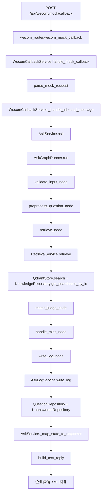

# 请求调用链：用户问「客户数据同步失败怎么办？」

本文只追踪主链路：企业微信入口 → 问答服务 → LangGraph 工作流 → 知识库检索 → 未命中沉淀 → 企业微信回复。

说明：

1. 当前 MVP 的企业微信真实接入仍是预留能力，本地演示主入口是 `POST /api/wecom/mock/callback`。
2. 示例问题「客户数据同步失败怎么办？」在当前种子知识里没有专门的“数据同步失败”知识卡片，所以本文按“未命中知识库”的主链路追踪。
3. 如果以后人工补了“数据同步失败”知识卡片，并审核通过、启用、同步向量库，那么流程会在命中判断后进入“生成答案”分支，文末有差异说明。
4. Java 后端开发者可以把这套结构理解为：`Controller -> Application Service -> Workflow/StateMachine -> Domain Service -> Repository/外部组件 -> DTO Response`。

## 0. 示例请求

本地企微 Mock 请求：

```http
POST /api/wecom/mock/callback
Content-Type: application/json

{
  "msg_id": "demo-sync-001",
  "from_user": "wecom_user_demo",
  "to_user": "corp_agent",
  "chat_id": "wecom_group_demo",
  "msg_type": "text",
  "content": "客户数据同步失败怎么办？",
  "create_time": 1718000000
}
```

最终业务结果大致是：

```text
matched=false
answer=当前知识库未找到明确答案，已记录为待沉淀问题，建议人工确认后再处理。
source_type=wecom
unanswered_question.status=pending
```

## 1. 总览图



## 2. 逐步调用链

### 第 1 步：FastAPI 应用挂载路由

**进入文件**：`app/main.py`

**调用类 / 函数**：`create_app()`

**输入是什么**：应用启动时读取配置 `settings`，创建 `FastAPI` 实例。

**输出是什么**：返回 `app` 对象，里面挂载了多个路由，其中包括 `wecom_router`。

**下游调用了谁**：`app.include_router(wecom_router)`

**这一层在业务中负责什么**：把企业微信回调入口注册到 Web 服务里。

**Java 后端开发者理解**：类似 Spring Boot 启动时扫描并注册 `@RestController`，让 `/api/wecom/**` 这些路径能被请求到。

### 第 2 步：进入企业微信 Mock Controller

**进入文件**：`app/routers/wecom_router.py`

**调用类 / 函数**：`wecom_mock_callback(payload, db)`

**输入是什么**：

```text
payload = WecomMockCallbackRequest(
  msg_id="demo-sync-001",
  from_user="wecom_user_demo",
  to_user="corp_agent",
  chat_id="wecom_group_demo",
  msg_type="text",
  content="客户数据同步失败怎么办？",
  create_time=1718000000
)
db = 当前请求的 SQLAlchemy Session
```

**输出是什么**：`fastapi.Response`，内容是企业微信被动回复 XML。

**下游调用了谁**：`WecomCallbackService(db).handle_mock_callback(payload)`

**这一层在业务中负责什么**：接收企业微信 Mock 请求，把 HTTP 请求交给企业微信回调服务处理。

**Java 后端开发者理解**：这就是 `@PostMapping("/api/wecom/mock/callback")` 的 Controller 方法，参数绑定 JSON，请求级 DB Session 类似一次请求里的事务上下文。

### 第 3 步：创建请求级数据库 Session

**进入文件**：`app/db/database.py`

**调用类 / 函数**：`get_db()`

**输入是什么**：FastAPI 依赖注入触发，无业务入参。

**输出是什么**：一个请求级 `Session`，请求结束后关闭。

**下游调用了谁**：被 `wecom_mock_callback(..., db=Depends(get_db))` 使用。

**这一层在业务中负责什么**：保证这次提问写日志、写未命中问题时使用同一个数据库会话。

**Java 后端开发者理解**：类似 Spring 里一次请求进入 Service 后拿到同一个事务/EntityManager/SqlSession。这里只负责提供 Session，不负责具体业务。

### 第 4 步：企业微信回调编排入口

**进入文件**：`app/services/wecom_callback_service.py`

**调用类 / 函数**：`WecomCallbackService.handle_mock_callback(payload)`

**输入是什么**：第 2 步的 `WecomMockCallbackRequest`。

**输出是什么**：XML 字符串。

**下游调用了谁**：

1. `parse_mock_request(payload)`
2. `self._handle_inbound_message(message)`

**这一层在业务中负责什么**：把企业微信 Mock JSON 转成统一的企业微信入站消息，然后进入通用处理流程。

**Java 后端开发者理解**：这是一个 Application Service。Controller 不写业务，它把请求交给 Service，Service 负责协调解析、去重、问答和回复。

### 第 5 步：把企微 Mock JSON 转成统一消息对象

**进入文件**：`app/wecom/message_parser.py`

**调用类 / 函数**：`parse_mock_request(payload)`

**输入是什么**：

```text
WecomMockCallbackRequest.content = "客户数据同步失败怎么办？"
WecomMockCallbackRequest.msg_type = "text"
WecomMockCallbackRequest.from_user = "wecom_user_demo"
WecomMockCallbackRequest.chat_id = "wecom_group_demo"
```

**输出是什么**：

```text
WecomInboundMessage(
  msg_id="demo-sync-001",
  from_user="wecom_user_demo",
  to_user="corp_agent",
  chat_id="wecom_group_demo",
  msg_type="text",
  content="客户数据同步失败怎么办？",
  create_time=1718000000
)
```

**下游调用了谁**：返回给 `WecomCallbackService._handle_inbound_message(message)`。

**这一层在业务中负责什么**：统一不同来源的企微消息格式。Mock JSON 和真实 XML 最终都会变成 `WecomInboundMessage`。

**Java 后端开发者理解**：类似把外部接口 DTO 转成内部 Command/DTO，避免后面的业务代码关心“这是 JSON 来的还是 XML 来的”。

### 第 6 步：处理企业微信入站消息

**进入文件**：`app/services/wecom_callback_service.py`

**调用类 / 函数**：`WecomCallbackService._handle_inbound_message(message)`

**输入是什么**：第 5 步的 `WecomInboundMessage`。

**输出是什么**：企业微信被动回复 XML 字符串。

**下游调用了谁**：

1. `self.dedup_store.get_cached_xml(message.msg_id)`
2. `AskService(self.session).ask(AskRequest(...))`
3. `build_text_reply(message, ask_response)`
4. `self.dedup_store.save_xml(message.msg_id, xml_body)`

**这一层在业务中负责什么**：

1. 按 `msg_id` 防重复。
2. 只处理文本消息。
3. 把企业微信消息转成问答请求。
4. 把问答结果转回企业微信 XML。

**Java 后端开发者理解**：类似一个消息适配器。它不做 RAG，不做 LLM，只负责“企微协议 ↔ 内部问答服务”的转换和幂等处理。

本例组装出的内部问答请求是：

```text
AskRequest(
  question="客户数据同步失败怎么办？",
  user_id="wecom_user_demo",
  group_id="wecom_group_demo",
  source_type="wecom"
)
```

### 第 7 步：问答业务门面

**进入文件**：`app/services/ask_service.py`

**调用类 / 函数**：`AskService.ask(payload)`

**输入是什么**：第 6 步生成的 `AskRequest`。

**输出是什么**：`AskResponse`，本例最终会是未命中响应。

**下游调用了谁**：

1. `self._build_initial_state(payload)`
2. `AskGraphRunner(self.session).run(initial_state)`
3. `self._map_state_to_response(final_state)`

**这一层在业务中负责什么**：问答主入口。它把请求转成工作流状态，调用 LangGraph 跑完整流程，再把最终状态转成 API 响应。

**Java 后端开发者理解**：类似 `AskApplicationService.ask()`，对外暴露一个稳定方法，内部细节交给状态机/工作流执行。

### 第 8 步：构造 LangGraph 初始 State

**进入文件**：`app/services/ask_service.py`

**调用类 / 函数**：`AskService._build_initial_state(payload)`

**输入是什么**：

```text
question="客户数据同步失败怎么办？"
user_id="wecom_user_demo"
group_id="wecom_group_demo"
source_type="wecom"
```

**输出是什么**：`AskState` 字典，关键字段如下：

```text
question_raw="客户数据同步失败怎么办？"
user_id="wecom_user_demo"
group_id="wecom_group_demo"
source_type="wecom"
is_valid=false
should_write_log=false
matched=false
similarity_score=0.0
sources=[]
answer=""
need_human=false
risk_level="low"
question_log_id=null
```

**下游调用了谁**：`AskGraphRunner.run(initial_state)`

**这一层在业务中负责什么**：初始化一次问答流程需要携带的上下文。

**Java 后端开发者理解**：类似创建一个 `AskContext` 或 `ProcessContext`，后续每个节点都往这个上下文里读写字段。

### 第 9 步：执行 LangGraph 工作流

**进入文件**：`app/agent/graph_runner.py`

**调用类 / 函数**：`AskGraphRunner.run(state)`

**输入是什么**：第 8 步的初始 `AskState`。

**输出是什么**：执行完全部节点后的最终 `AskState`。

**下游调用了谁**：

1. `get_compiled_ask_graph()`
2. 默认情况下调用 `graph.invoke(state, config)`

其中 `config` 里注入了数据库 Session：

```text
{"configurable": {"db": self.session}}
```

**这一层在业务中负责什么**：把数据库 Session 注入工作流，并启动问答状态机。

**Java 后端开发者理解**：类似调用一个已经编排好的状态机或责任链，并把请求上下文传进去。默认 LangSmith 关闭时，就是普通同步调用。

### 第 10 步：工作流定义节点顺序

**进入文件**：`app/agent/workflow.py`

**调用类 / 函数**：`build_ask_workflow()` / `get_compiled_ask_graph()`

**输入是什么**：构建阶段不接收本次业务参数；运行时接收 `AskState`。

**输出是什么**：编译好的 LangGraph。

**下游调用了谁**：按条件依次进入这些节点：

```text
validate_input
-> preprocess_question
-> retrieve
-> match_judge
-> handle_miss
-> write_log
-> END
```

本例因为未命中，所以走 `handle_miss`。如果命中，则走 `generate_answer`。

**这一层在业务中负责什么**：定义问答流程的节点和分支规则。

**Java 后端开发者理解**：类似用代码声明一个状态机：先校验，再预处理，再检索，再判断命中，最后生成回答或兜底，并写日志。

### 第 11 步：校验问题是否为空

**进入文件**：`app/agent/nodes.py`

**调用类 / 函数**：`validate_input_node(state, config)`

**输入是什么**：

```text
state.question_raw = "客户数据同步失败怎么办？"
```

**输出是什么**：

```text
is_valid=true
should_write_log=true
question_raw="客户数据同步失败怎么办？"
route="continue"
```

**下游调用了谁**：`workflow.route_after_validate(state)`，然后进入 `preprocess_question_node`。

**这一层在业务中负责什么**：挡掉空问题。空问题不写日志，也不进入检索。

**Java 后端开发者理解**：类似 Service 入口的参数校验。校验不通过就直接返回，不继续占用后面的检索和模型资源。

### 第 12 步：问题预处理

**进入文件**：`app/agent/nodes.py`

**调用类 / 函数**：`preprocess_question_node(state, config)`

**输入是什么**：

```text
question_raw="客户数据同步失败怎么办？"
user_id="wecom_user_demo"
group_id="wecom_group_demo"
source_type="wecom"
```

**输出是什么**：

```text
question_masked="客户数据同步失败怎么办？"
rewritten_question="客户数据同步失败怎么办？"
intent="question"
user_id="wecom_user_demo"
group_id="wecom_group_demo"
source_type="wecom"
```

**下游调用了谁**：`retrieve_node`

**这一层在业务中负责什么**：为后续检索准备问题文本。当前 MVP 中脱敏和改写还是占位实现，所以等于原文。

**Java 后端开发者理解**：类似进入业务处理前做标准化、脱敏、意图识别。现在这层很薄，但位置已经预留好了。

### 第 13 步：进入检索节点

**进入文件**：`app/agent/nodes.py`

**调用类 / 函数**：`retrieve_node(state, config)`

**输入是什么**：

```text
question_masked="客户数据同步失败怎么办？"
config.configurable.db=当前请求的数据库 Session
```

**输出是什么**：本例按未命中，输出形态类似：

```text
retrieval_error=false
retrieval_time_ms=若干毫秒
_raw_matched=false
_raw_fallback_reason="向量检索未命中" 或 "相似度低于阈值"
_raw_similarity_score=0.0 或低于阈值的分数
retrieval_hits=[]
route="ok"
```

**下游调用了谁**：`RetrievalService(session).retrieve(question_masked)`

**这一层在业务中负责什么**：把工作流里的 state 交给检索服务，并把检索结果写回 state。

**Java 后端开发者理解**：这是状态机中的一个节点，真正的检索逻辑不写在节点里，而是委托给 `RetrievalService`。

### 第 14 步：RAG 检索服务

**进入文件**：`app/services/retrieval_service.py`

**调用类 / 函数**：`RetrievalService.retrieve(question)`

**输入是什么**：

```text
question="客户数据同步失败怎么办？"
top_k=settings.top_k
threshold=settings.similarity_threshold
```

**输出是什么**：`RetrievalResult`。本例按未命中：

```text
RetrievalResult(
  matched=false,
  similarity_score=0.0 或低于阈值的分数,
  best_hit=null 或低分 hit,
  hits=[] 或低分有效 hit 列表,
  fallback_reason="向量检索未命中" 或 "相似度低于阈值",
  error=null
)
```

**下游调用了谁**：

1. `self.qdrant.search(question, top_k=self.top_k)`
2. `self._validate_hits(raw_hits)`
3. `_validate_hits` 内部调用 `KnowledgeRepository.get_searchable_by_id(card_id)`

**这一层在业务中负责什么**：先问向量库“有没有相似知识”，再回 MySQL 确认这些知识卡片是不是仍然有效、已审核、已启用。

**Java 后端开发者理解**：类似一个领域服务，先查搜索引擎/向量库，再用数据库 Repository 做二次校验。不能只相信搜索引擎返回，因为业务主数据在 MySQL。

### 第 15 步：向量库查询

**进入文件**：`app/rag/qdrant_store.py`

**调用类 / 函数**：`QdrantStore.search(query_text, top_k)`

**输入是什么**：

```text
query_text="客户数据同步失败怎么办？"
top_k=默认 5
```

**输出是什么**：`list[QdrantSearchHit]`，每条包含：

```text
card_id
title
score
payload
```

如果向量库没有相似内容，返回空列表。

**下游调用了谁**：

1. `EmbeddingService.embed_text(query_text)`
2. `QdrantClient.query_points(...)`

**这一层在业务中负责什么**：把用户问题转成向量，再从 Qdrant 中找相似知识卡片。

**Java 后端开发者理解**：类似调用 Elasticsearch/OpenSearch 搜索，只是这里用的是向量相似度，不是传统关键词匹配。

### 第 16 步：回查 MySQL 过滤不可用知识

**进入文件**：`app/repositories/knowledge_repository.py`

**调用类 / 函数**：`KnowledgeRepository.get_searchable_by_id(card_id)`

**输入是什么**：Qdrant 返回的 `card_id`。

**输出是什么**：

```text
KnowledgeCard 或 None
```

只有满足下面条件才返回卡片：

```text
deleted=0
audit_status="approved"
enabled=1
```

**下游调用了谁**：SQLAlchemy 查询 `knowledge_card` 表。

**这一层在业务中负责什么**：确保只有审核通过且启用的知识能参与回答。

**Java 后端开发者理解**：这是典型 Repository 层。相当于 `knowledgeCardMapper.selectSearchableById(cardId)`，把业务过滤条件固化在查询里。

### 第 17 步：命中判断

**进入文件**：`app/agent/nodes.py`

**调用类 / 函数**：`match_judge_node(state, config)`

**输入是什么**：

```text
_raw_matched=false
_raw_similarity_score=0.0 或低于阈值的分数
_raw_fallback_reason="向量检索未命中" 或 "相似度低于阈值"
retrieval_hits=[]
```

**输出是什么**：

```text
matched=false
sources=[]
matched_card_ids=""
similarity_score=0.0 或低于阈值的分数
fallback_reason="向量检索未命中" 或 "相似度低于阈值"
route="miss"
```

**下游调用了谁**：`workflow.route_after_match(state)`，本例进入 `handle_miss_node`。

**这一层在业务中负责什么**：把检索结果转换成业务判断：到底算不算命中知识库。

**Java 后端开发者理解**：类似规则判断层。检索服务返回原始结果，这里决定后续走“生成答案”还是“未命中兜底”。

### 第 18 步：未命中处理

**进入文件**：`app/agent/nodes.py`

**调用类 / 函数**：`handle_miss_node(state, config)`

**输入是什么**：

```text
matched=false
fallback_reason="向量检索未命中" 或 "相似度低于阈值"
question_masked="客户数据同步失败怎么办？"
```

**输出是什么**：

```text
answer="当前知识库未找到明确答案，已记录为待沉淀问题，建议人工确认后再处理。"
need_human=false
risk_level="low"
llm_tokens=null
answer_time_ms=0
error_stage=null
error_message=null
```

**下游调用了谁**：`write_log_node`

**这一层在业务中负责什么**：未命中时不调用大模型编答案，而是返回固定保守话术。

**Java 后端开发者理解**：这是兜底分支。它避免“没有知识还硬答”，更像客服系统里的“转人工/待沉淀”策略。

### 第 19 步：写日志节点

**进入文件**：`app/agent/nodes.py`

**调用类 / 函数**：`write_log_node(state, config)`

**输入是什么**：包含问题、检索结果、未命中回答、用户信息的 `AskState`。

**输出是什么**：

```text
question_log_id=新写入的 question_log.id
latency_ms=本次请求总耗时
```

**下游调用了谁**：`AskLogService(session).write_log(state)`

**这一层在业务中负责什么**：把“写库”作为工作流最后一步，保证问答过程可追踪。

**Java 后端开发者理解**：类似责任链最后的持久化节点，把前面所有处理结果落库。

### 第 20 步：写 question_log，并沉淀 unanswered_question

**进入文件**：`app/services/ask_log_service.py`

**调用类 / 函数**：`AskLogService.write_log(state)`

**输入是什么**：

```text
question_raw="客户数据同步失败怎么办？"
question_masked="客户数据同步失败怎么办？"
user_id="wecom_user_demo"
group_id="wecom_group_demo"
source_type="wecom"
matched=false
similarity_score=0.0 或低分
answer="当前知识库未找到明确答案，已记录为待沉淀问题，建议人工确认后再处理。"
fallback_reason="向量检索未命中" 或 "相似度低于阈值"
```

**输出是什么**：`question_log_id`。

**下游调用了谁**：

1. `self.create_question_log(state, latency_ms=...)`
2. `self.upsert_unanswered_question(state, question_log_id=...)`
3. `self.question_repo.save()`

**这一层在业务中负责什么**：

1. 每次有效提问都写入 `question_log`。
2. 未命中且不是检索异常时，写入或更新 `unanswered_question`。

**Java 后端开发者理解**：这是事务性应用服务。类似一个 `@Transactional` 方法：先插日志，再根据业务条件插入/更新未命中问题，最后提交事务。

### 第 21 步：创建提问日志

**进入文件**：`app/services/ask_log_service.py`

**调用类 / 函数**：`AskLogService.create_question_log(state, latency_ms)`

**输入是什么**：第 20 步的 state 和总耗时。

**输出是什么**：已 `flush` 的 `QuestionLog` ORM 对象，带数据库主键 `id`。

**下游调用了谁**：`QuestionRepository.create_log(log)`

**这一层在业务中负责什么**：记录这次问答发生了什么。

关键落库字段包括：

```text
question_raw="客户数据同步失败怎么办？"
source_type="wecom"
matched=0
matched_card_ids=null
answer=未命中固定话术
fallback_reason=未命中原因
need_human=0
risk_level="low"
```

**Java 后端开发者理解**：类似构造 `QuestionLogEntity`，调用 `questionLogMapper.insert(entity)`，然后拿到自增 ID。

### 第 22 步：写入或递增未命中问题

**进入文件**：`app/services/ask_log_service.py`

**调用类 / 函数**：`AskLogService.upsert_unanswered_question(state, question_log_id)`

**输入是什么**：

```text
question_masked="客户数据同步失败怎么办？"
normalized_question="客户数据同步失败怎么办？"
summary="客户数据同步失败怎么办？"
question_log_id=第 21 步生成的日志 ID
```

**输出是什么**：无直接返回值，但会写入或更新 `unanswered_question`。

**下游调用了谁**：

1. `UnansweredRepository.get_pending_by_normalized(normalized_question)`
2. 如果已有 pending：`UnansweredRepository.increment_frequency(existing, question_log_id=...)`
3. 如果没有 pending：`UnansweredRepository.create(record)`

**这一层在业务中负责什么**：把答不上来的问题变成“待沉淀问题池”里的记录。

本例如果第一次出现，会创建：

```text
question="客户数据同步失败怎么办？"
normalized_question="客户数据同步失败怎么办？"
frequency=1
status="pending"
question_log_id=本次日志 ID
```

如果之前已经有同样的 pending 问题，则只增加 `frequency`，并更新最近一次日志 ID。

**Java 后端开发者理解**：这是典型 upsert 业务逻辑。不是数据库原生 upsert，而是先查 pending，再决定 insert 还是 update。

### 第 23 步：将最终 State 映射成 AskResponse

**进入文件**：`app/services/ask_service.py`

**调用类 / 函数**：`AskService._map_state_to_response(state)`

**输入是什么**：LangGraph 执行后的最终 `AskState`。

**输出是什么**：

```text
AskResponse(
  matched=false,
  answer="当前知识库未找到明确答案，已记录为待沉淀问题，建议人工确认后再处理。",
  sources=[],
  similarity_score=0.0 或低分,
  question_log_id=第 21 步生成的日志 ID,
  fallback_reason="向量检索未命中" 或 "相似度低于阈值",
  need_human=false,
  risk_level="low"
)
```

**下游调用了谁**：返回给 `WecomCallbackService._handle_inbound_message`。

**这一层在业务中负责什么**：把内部工作流状态转成对外稳定响应结构。

**Java 后端开发者理解**：类似把 `AskContext` 转成 `AskResponseDTO`。内部字段很多，但 API 只暴露固定字段。

### 第 24 步：把 AskResponse 转成企业微信 XML

**进入文件**：`app/wecom/response_builder.py`

**调用类 / 函数**：`build_text_reply(message, ask_response)`

**输入是什么**：

```text
message.from_user="wecom_user_demo"
message.to_user="corp_agent"
ask_response.answer="当前知识库未找到明确答案，已记录为待沉淀问题，建议人工确认后再处理。"
ask_response.need_human=false
```

**输出是什么**：企业微信被动回复 XML 字符串，形态如下：

```xml
<xml>
  <ToUserName><![CDATA[wecom_user_demo]]></ToUserName>
  <FromUserName><![CDATA[corp_agent]]></FromUserName>
  <CreateTime>1718000000</CreateTime>
  <MsgType><![CDATA[text]]></MsgType>
  <Content><![CDATA[当前知识库未找到明确答案，已记录为待沉淀问题，建议人工确认后再处理。]]></Content>
</xml>
```

**下游调用了谁**：内部调用 `build_fixed_reply(message, content)`。

**这一层在业务中负责什么**：把系统内部答案包装成企业微信要求的被动回复 XML。

**Java 后端开发者理解**：类似把业务 DTO 转成第三方平台要求的响应报文。这里不是返回 JSON，而是返回 XML。

### 第 25 步：缓存本次 XML，避免重复处理

**进入文件**：`app/wecom/dedup_store.py`

**调用类 / 函数**：`WecomDedupStore.save_xml(msg_id, xml_body)`

**输入是什么**：

```text
msg_id="demo-sync-001"
xml_body=第 24 步生成的 XML
```

**输出是什么**：无返回值，进程内缓存一份 XML。

**下游调用了谁**：无外部下游。

**这一层在业务中负责什么**：如果企业微信用同一个 `msg_id` 重试推送，系统直接返回缓存 XML，不重复写 `question_log`，也不重复增加未命中频次。

**Java 后端开发者理解**：类似本地内存幂等表。生产多实例一般会换成 Redis 或数据库幂等表；当前 MVP 是进程内 TTL 缓存。

### 第 26 步：Controller 返回企业微信响应

**进入文件**：`app/routers/wecom_router.py`

**调用类 / 函数**：`wecom_mock_callback(payload, db)`

**输入是什么**：第 24 步生成的 XML 字符串。

**输出是什么**：

```text
Response(content=xml_body, media_type="application/xml")
```

**下游调用了谁**：FastAPI / ASGI 把 HTTP 响应返回给调用方。

**这一层在业务中负责什么**：结束本次企业微信请求。

**Java 后端开发者理解**：类似 Controller 返回 `ResponseEntity<String>`，`Content-Type=application/xml`。

## 3. 本例最终落库结果

### question_log

本例会新增一条有效提问日志：

```text
question_raw=客户数据同步失败怎么办？
question_masked=客户数据同步失败怎么办？
rewritten_question=客户数据同步失败怎么办？
user_id=wecom_user_demo
group_id=wecom_group_demo
source_type=wecom
matched=0
matched_card_ids=null
similarity_score=0.0 或低分
answer=当前知识库未找到明确答案，已记录为待沉淀问题，建议人工确认后再处理。
fallback_reason=向量检索未命中 或 相似度低于阈值
risk_level=low
```

### unanswered_question

如果这是第一次出现：

```text
question=客户数据同步失败怎么办？
normalized_question=客户数据同步失败怎么办？
summary=客户数据同步失败怎么办？
frequency=1
status=pending
```

如果已有同样的 pending 记录：

```text
frequency += 1
last_seen_time=当前时间
question_log_id=本次新日志 ID
```

## 4. 如果这个问题命中了知识库，差异在哪里

如果后续已经沉淀了“客户数据同步失败怎么办？”相关知识卡片，并且满足：

```text
knowledge_card.deleted=0
knowledge_card.audit_status=approved
knowledge_card.enabled=1
knowledge_card 已同步到 Qdrant
相似度 >= settings.similarity_threshold
```

那么调用链前半段不变，差异从第 17 步开始：

1. `match_judge_node` 输出 `matched=true`、`sources=[...]`、`matched_card_ids="..."`。
2. `workflow.route_after_match` 进入 `generate_answer_node`，不走 `handle_miss_node`。
3. `generate_answer_node` 调用 `AnswerGenerationService.generate(question, hits)`。
4. `AnswerGenerationService` 组装知识卡片上下文，调用 `PromptService.generate_answer(...)`。
5. `PromptService` 通过 `LLMFactory.get_llm_client(...)` 选择 MockLLM 或 DeepSeek。
6. 返回的 `AskResponse` 会包含 `matched=true`、答案正文、命中来源 `sources` 和相似度。
7. `AskLogService.write_log` 只写 `question_log`，不会写入 `unanswered_question`。

Java 后端开发者可以理解为：状态机同一个入口，只是在“命中判断”这里走了另一条分支；命中分支会调用 LLM 生成答案，未命中分支只返回固定兜底并进入待沉淀池。

## 5. Web `/api/ask` 入口的区别

如果不是企业微信，而是 Web 测试页或直接调用：

```http
POST /api/ask
```

会进入：

```text
app/routers/ask_router.py
ask_question(payload, db)
```

然后直接调用：

```text
AskService(db).ask(payload)
```

也就是说，Web 入口会从本文第 7 步开始复用同一条问答主链路，只是没有企业微信的消息解析、XML 回复和 `msg_id` 去重。
