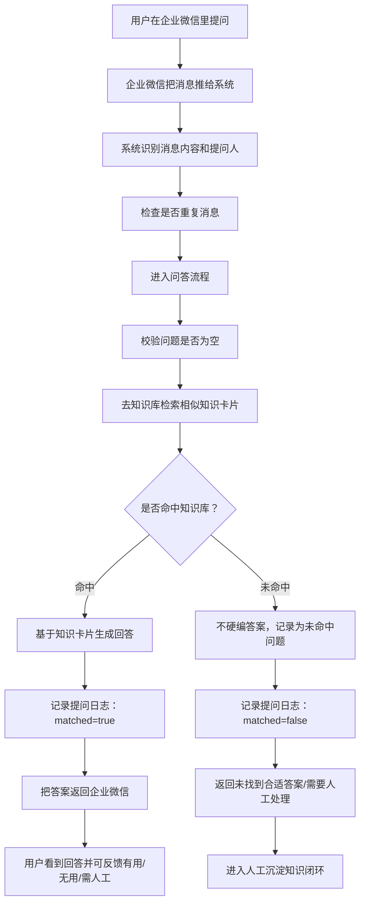
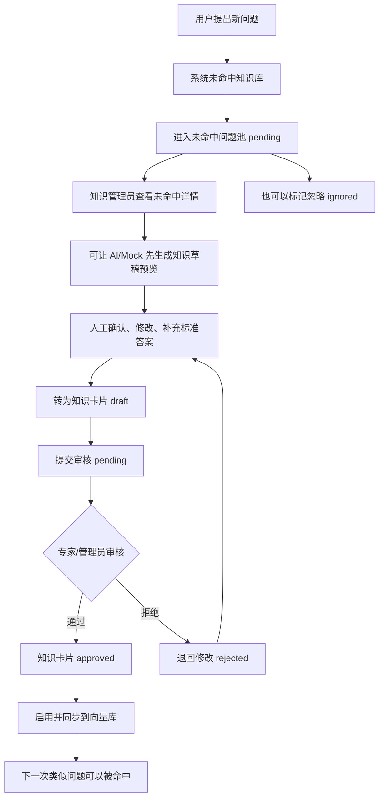

# 企微数字员工 MVP 业务流程

## 1. 这个项目到底解决什么问题

这个项目想解决的是：实施群里很多问题反复问、反复答，但答案散在聊天记录、个人经验和临时文档里，时间久了就很难复用。

企微数字员工的目标不是替代专家，而是先把「能标准化回答的问题」自动答掉，把「答不上来的问题」自动收集起来，再让人工把它沉淀成知识卡片。这样下一次别人再问类似问题，系统就能直接回答。

用大白话说，它做三件事：

1. 用户在企业微信里问问题，系统先去知识库里找有没有相似答案。
2. 找到了，就根据知识卡片组织一段回答并返回给用户。
3. 找不到，就把这个问题记下来，后面由人工补成知识卡片，让知识库越来越完整。

当前项目是可演示、可验收的 MVP。企业微信真实生产接入还属于预留能力；本地主要通过企业微信 Mock 回调和 Web 在线测试来演示完整业务流程。

## 2. 参与角色

| 角色 | 负责什么 |
|------|----------|
| 提问人 | 在企业微信实施群或测试页面里提出业务问题 |
| 数字员工 | 接收问题、检索知识库、生成回答、记录日志 |
| 知识管理员 / 专家 | 审核知识卡片，处理未命中问题，把经验沉淀成知识 |
| 管理者 | 看命中率、未命中率、满意度、Top 问题，判断知识库质量 |

## 3. 从企业微信提问到返回答案的完整流程

下面这张图按业务视角描述完整链路：



业务上可以把它理解成一个「先查标准答案，再决定是否转人工沉淀」的流程。

## 4. 命中知识库时发生什么

命中知识库指的是：系统在已经审核通过、已启用、已同步到向量库的知识卡片里，找到了和用户问题足够相似的内容。

流程是：

1. 用户提问。
2. 系统拿问题去知识库里检索相似卡片。
3. 相似度达到阈值，系统判断为命中。
4. 系统把命中的知识卡片作为依据，生成一段更像人话的回答。
5. 返回给企业微信用户。
6. 同时记录这次提问日志，包括是否命中、来源、相似度、答案来源等信息。
7. 用户可以反馈「有用」「无用」「需要人工处理」。
8. 反馈进入统计看板，用来判断知识质量。

命中时，核心价值是减少重复答疑。实施人员不用每次都等专家回复，常见问题可以直接被数字员工处理。

## 5. 未命中知识库时发生什么

未命中知识库指的是：系统没有找到足够相似、可用、已审核的知识卡片。

流程是：

1. 用户提问。
2. 系统检索知识库。
3. 没有找到可信答案，系统判断为未命中。
4. 系统不会为了看起来智能而硬编一个答案。
5. 系统把问题写入「未命中问题」列表，并记录出现次数。
6. 返回给用户一个保守结果，提示当前没有合适答案，需要人工处理或后续补充。
7. 知识管理员后续在后台处理这些未命中问题。

未命中不是失败，而是知识库变好的入口。它告诉团队：哪些问题大家正在问，但知识库还没覆盖。

## 6. 人工沉淀知识卡片的业务闭环

人工沉淀闭环是这个 MVP 最重要的业务闭环：系统不是只回答一次，而是把答不上来的问题变成下一次能回答的知识。



这个闭环可以拆成四步：

1. 系统自动发现盲区  
   用户问了知识库没有覆盖的问题，系统把它放进未命中问题池。

2. 人工判断是否值得沉淀  
   如果这是个偶发、无价值的问题，可以忽略；如果是高频或重要问题，就转成知识卡片。

3. 专家审核，避免脏知识进库  
   草稿不会直接进入正式知识库，需要审核通过后才算可用知识。

4. 同步到检索库，反哺问答  
   审核通过并启用后，知识卡片会同步到向量库。下一次用户问类似问题，系统就能命中并回答。

## 7. 一条问题的两种结局

| 场景 | 系统判断 | 对用户的结果 | 对后台的结果 | 业务意义 |
|------|----------|--------------|--------------|----------|
| 命中知识库 | 找到相似知识卡片 | 返回答案 | 记录命中日志，可收集反馈 | 降低重复答疑成本 |
| 未命中知识库 | 没有可信知识 | 返回保守提示，等待人工 | 进入未命中问题池 | 暴露知识盲区，推动沉淀 |

## 8. 反馈和统计怎么帮助运营

问答结束后，用户可以反馈结果质量：

| 反馈 | 含义 |
|------|------|
| 有用 | 这次回答基本解决问题 |
| 无用 | 回答不准、不完整或没帮上忙 |
| 需要人工处理 | 问题可能复杂，需要专家介入 |

这些反馈会进入统计看板。管理者可以看到：

1. 命中率：知识库覆盖得怎么样。
2. 未命中率：还有多少问题答不上来。
3. 满意度：命中的回答质量怎么样。
4. Top 未命中：最值得优先沉淀的问题。
5. Top 负反馈：最需要优化的知识卡片或回答场景。

所以这个系统不是单纯的聊天机器人，而是一个「知识运营工具」。它既回答问题，也告诉团队下一步该补哪些知识、改哪些答案。

## 9. MVP 当前边界

当前项目已经打通业务闭环，但仍是 MVP：

1. 企业微信真实生产接入是预留能力，本地主要用 Mock 回调验证。
2. 默认可以用 MockLLM 演示，没有真实大模型 Key 也能跑通流程。
3. Qdrant 使用本地向量库，适合演示和验收，不是生产集群形态。
4. 真实上线前还需要补齐企业微信加解密、公网 HTTPS、鉴权、脱敏、多实例去重等能力。

从业务理解上看，当前 MVP 已经证明了这条主线是成立的：

```text
企业微信提问 → 知识库检索 → 命中则回答 → 未命中则沉淀 → 审核成知识 → 再反哺问答
```
