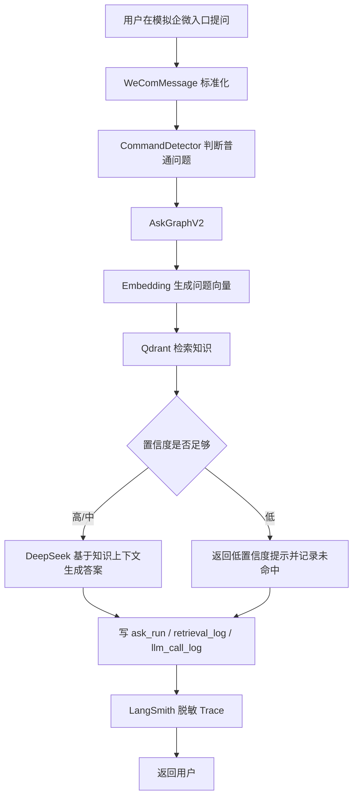
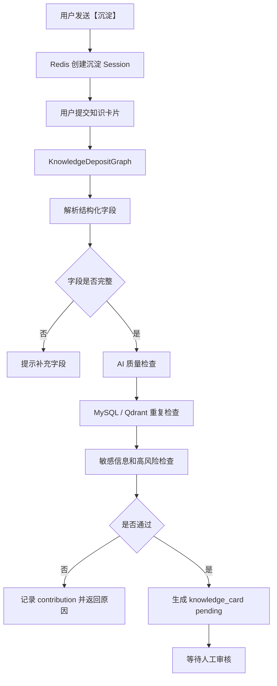
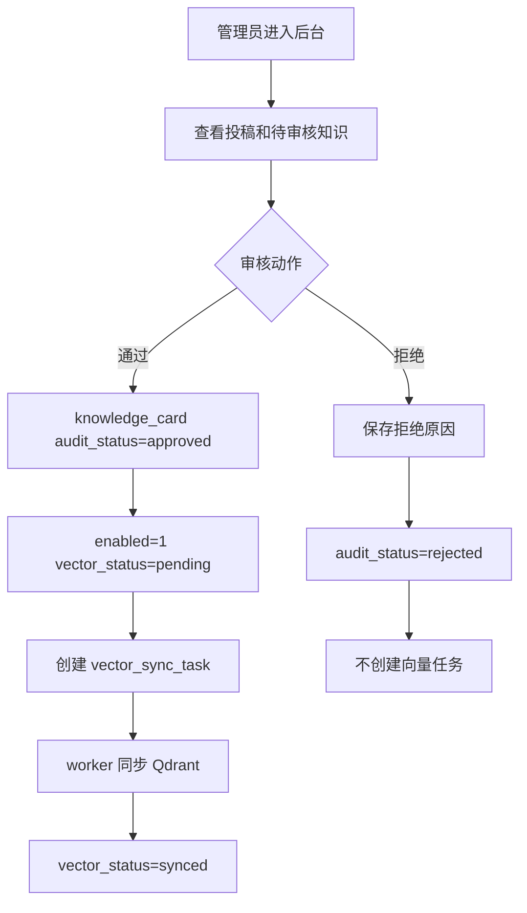
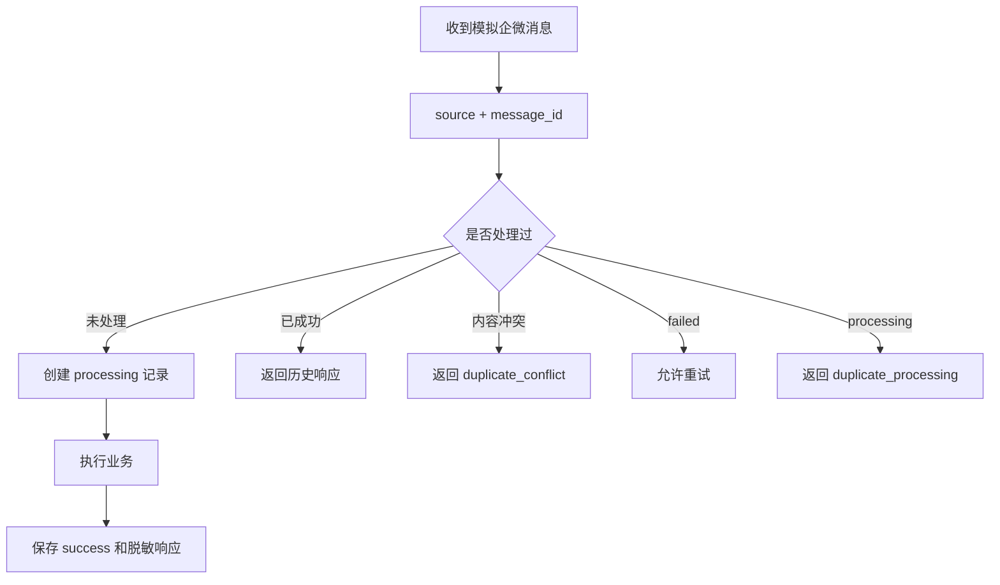

# 业务流程说明

## 1. 普通问答流程

**要点**：

- 入口：`POST /api/mock/wecom/message` 或 `POST /api/ask-v2`
- 低置信度不强答，写入 `unanswered_question`（AskGraphV2 路径）
- 原 MVP `/api/ask` 仍保留，未被替换

## 2. 知识沉淀流程

**要点**：

- 【沉淀】依赖 Redis Session（`DepositSessionService`）
- `pending` 知识**不会**直接写入 Qdrant
- 重复疑似、高风险会标记 `contribution` 状态，不自动合并/放行

## 3. 审核治理流程

**要点**：

- 审核通过由 `AdminReviewService.approve_knowledge` 入队 `vector_sync_task`
- worker：`python scripts/prod/run_vector_sync_worker.py`
- 审核/标记操作写入 `admin_operation_log`

## 4. 幂等流程

**要点**：

- 表：`message_process_log`
- 配置：`MESSAGE_DEDUP_ENABLED`、`MESSAGE_DEDUP_TTL_SECONDS`
- `processing` 超时自动恢复：本版本**未实现**，重复提交返回 `duplicate_processing`
