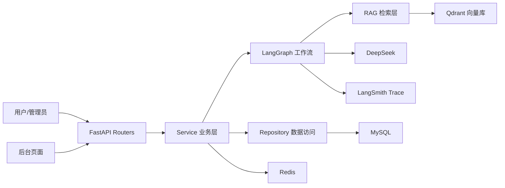

# 系统架构与模块职责

## 1. 总体架构图

## 2. app/core 职责

| 模块 | 职责 |
| --- | --- |
| `settings.py` | 统一配置（APP_ENV、LLM、Qdrant、Redis、鉴权、幂等等） |
| `env_validator.py` | dev/test/prod 配置硬校验 |
| `runtime_check.py` | 启动时配置检查，prod 错误阻止启动 |
| `startup_check.py` | prod 补充自检（鉴权、幂等、Git 跟踪 .env） |
| `admin_auth.py` | 后台 `X-Admin-Token` 鉴权 |
| `desensitize.py` | 日志/响应/快照脱敏 |

## 3. app/infra 职责

| 模块 | 职责 |
| --- | --- |
| `redis_client.py` | Redis 连接与沉淀 Session |
| `qdrant_client.py` | Qdrant 客户端 |
| `llm_client.py` / `embedding_client.py` | 外部 AI 调用 |
| `langsmith_tracing.py` | LangSmith 脱敏 Trace |

## 4. app/rag 职责

| 模块 | 职责 |
| --- | --- |
| `rag_retrieval_service.py` | 向量检索编排 |
| `qdrant_vector_store.py` | Qdrant 读写 |
| `vector_payload_builder.py` | payload 构建（不含完整正文） |
| `confidence.py` | 高/中/低置信度判定 |

## 5. app/graphs 职责

| 模块 | 职责 |
| --- | --- |
| `ask_graph_v2.py` | RAG 问答 LangGraph（检索→生成→落库） |
| `knowledge_deposit_graph.py` | 知识投稿 LangGraph（解析→质检→建卡） |

## 6. app/services 职责

| 服务 | 职责 |
| --- | --- |
| `AdminReviewService` | 投稿列表、审核通过/拒绝、人工标记 |
| `AdminOperationLogService` | 操作审计写入与查询 |
| `MessageIdempotencyService` | message_id 幂等 |
| `Stage3VectorSyncService` | 向量同步任务入队与 worker 执行 |
| `DepositSessionService` | Redis 沉淀 Session |
| `InfraHealthService` | 基础设施健康检查 |

## 7. app/repositories 职责

数据访问层，封装 SQLAlchemy 查询与持久化，不含业务判断。

## 8. app/routers 职责

| 路由前缀 | 说明 |
| --- | --- |
| `/api/health` | 基础健康 |
| `/api/infra` | AI 基础设施健康 |
| `/api/ask-v2` | RAG 问答 |
| `/api/mock/wecom` | 模拟企微入口 |
| `/api/admin` | 后台 REST（需 Token，可关闭） |
| `/admin` | 后台 HTML 页面 |
| `/api/ask` | MVP 原问答（保留） |

## 9. app/models 职责

ORM 模型，对应 MySQL 表。二期新增：`message_process_log`、`admin_operation_log`、`knowledge_contribution` 等。

## 10. scripts/prod 职责

生产/验收脚本：配置检查、RAG、沉淀、审核、幂等、安全扫描、一键回归、向量 worker/运维。

## 11. templates/admin 职责

| 页面 | 说明 |
| --- | --- |
| `contribution_list/detail` | 知识投稿审核 |
| `pending_knowledge_list/detail` | 待审核知识 |
| `operation_log_list/detail` | 操作审计 |
