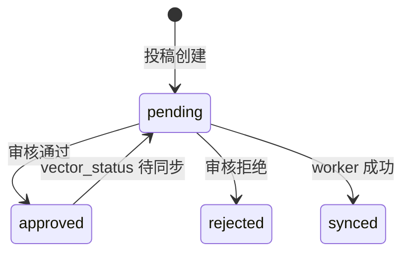

# 数据库表与状态流转

## 表清单概览

| 表名 | 作用 |
| --- | --- |
| knowledge_card | 结构化知识卡片 |
| knowledge_contribution | 模拟企微投稿记录 |
| ask_run | RAG 问答运行记录 |
| retrieval_log | 检索日志 |
| llm_call_log | LLM 调用日志 |
| vector_sync_task | 向量同步异步任务 |
| message_process_log | 消息幂等记录 |
| admin_operation_log | 后台操作审计 |
| unanswered_question | 未命中问题 |
| feedback_log | 用户反馈 |
| system_config | 系统配置 |

---

## knowledge_card

| 项 | 说明 |
| --- | --- |
| 作用 | 存储结构化知识，RAG 检索与审核主体 |
| 关键字段 | title, question, answer, audit_status, enabled, vector_status, content_hash |
| 写入 | 知识沉淀 Graph、后台审核、MVP 知识管理 |
| 读取 | RAG 检索、后台 pending 列表、向量同步 |

**audit_status**：`pending` / `approved` / `rejected`

**vector_status**：`waiting_review` / `pending` / `synced` / `failed` / `rejected`

---

## knowledge_contribution

| 项 | 说明 |
| --- | --- |
| 作用 | 记录每次模拟企微投稿及质检结果 |
| 关键字段 | contribution_id, status, knowledge_card_id, duplicate_suspected, risk_level |
| 写入 | KnowledgeDepositGraph |
| 读取 | 后台投稿列表 |

**status**（代码中实际使用，以代码为准）：

`received` / `checking` / `invalid` / `duplicate_suspected` / `risk_blocked` / `pending_card_created` / `approved` / `rejected` / `reviewed` / `ignore_duplicate` / `keep_blocked` / `failed`

---

## ask_run

| 项 | 说明 |
| --- | --- |
| 作用 | 单次 RAG 问答运行结果 |
| 关键字段 | run_id, status, confidence_level, top_score, answer |
| 写入 | AskGraphV2 |
| 读取 | 运维排查、统计 |

---

## vector_sync_task

| 项 | 说明 |
| --- | --- |
| 作用 | 审核通过后异步向量同步 |
| 关键字段 | knowledge_id, status, retry_count, max_retries |

**status**：`pending` / `running` / `success` / `failed` / `skipped`

---

## message_process_log

| 项 | 说明 |
| --- | --- |
| 作用 | mock_wecom message_id 幂等 |
| 关键字段 | source, message_id, content_hash, status, response_json |

**status**：`processing` / `success` / `failed`

---

## admin_operation_log

| 项 | 说明 |
| --- | --- |
| 作用 | 后台审核与人工标记审计 |
| 关键字段 | operation_id, operator, action, target_type, before/after_snapshot_json |
| 写入 | AdminReviewService 审核/标记时 |
| 读取 | `/api/admin/operation-logs`、审计页面 |

---

## 其他表（简要）

| 表 | 写入场景 | 读取场景 |
| --- | --- | --- |
| retrieval_log | AskGraphV2 检索 | 排查检索质量 |
| llm_call_log | DeepSeek 调用 | 排查 LLM |
| unanswered_question | 低置信度未命中 | 未命中列表页 |
| feedback_log | 用户反馈 | 统计看板 |
| system_config | init_db | 系统配置 |
