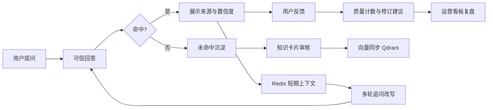
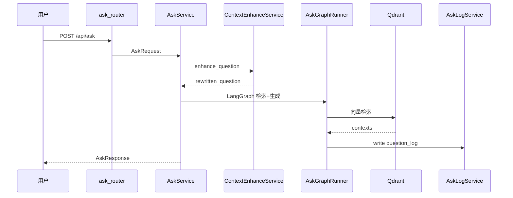
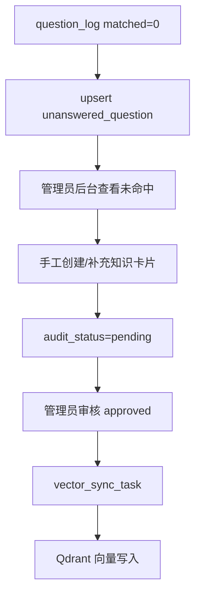
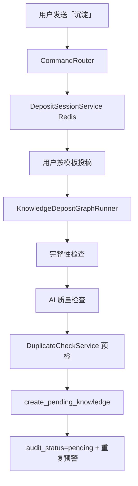
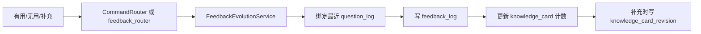
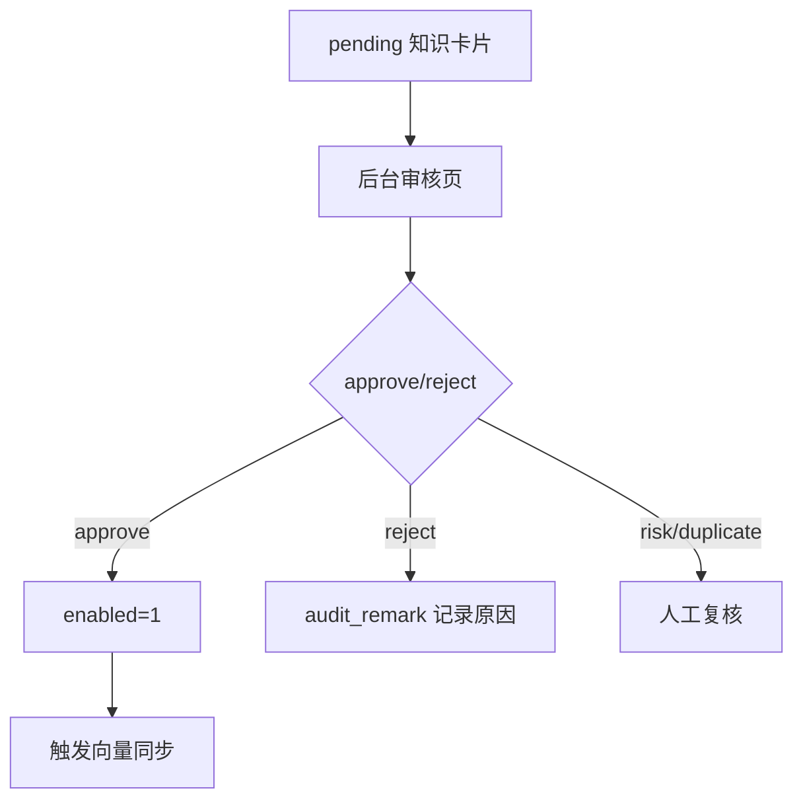
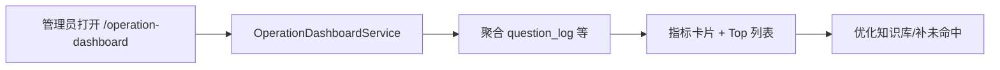
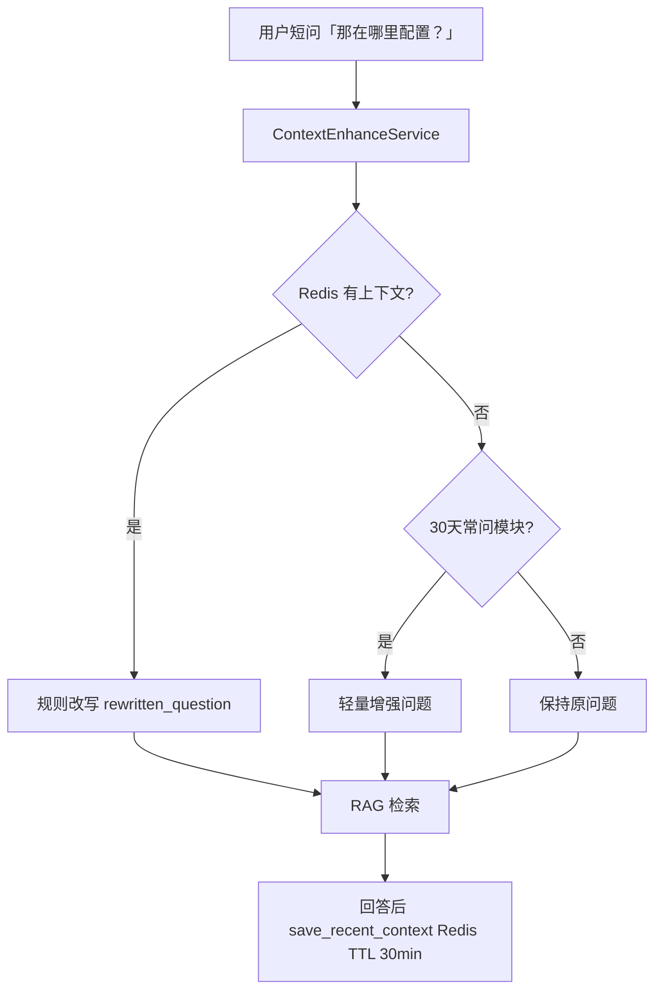

# 完整业务流程图

本文用 Mermaid 描述增强版七大核心流程。

## 1. 总览闭环

```mermaid
flowchart LR
    A[用户提问] --> B[可信回答]
    B --> C{命中?}
    C -->|是| D[展示来源与置信度]
    C -->|否| E[未命中沉淀]
    D --> F[用户反馈]
    F --> G[质量计数与修订建议]
    E --> H[知识卡片审核]
    H --> I[向量同步 Qdrant]
    G --> J[运营看板复盘]
    D --> K[Redis 短期上下文]
    K --> L[多轮追问改写]
    L --> B
```

## 2. 用户提问问答流程

```mermaid
sequenceDiagram
    participant U as 用户
    participant R as ask_router
    participant S as AskService
    participant C as ContextEnhanceService
    participant G as AskGraphRunner
    participant Q as Qdrant
    participant L as AskLogService

    U->>R: POST /api/ask
    R->>S: AskRequest
    S->>C: enhance_question
    C-->>S: rewritten_question
    S->>G: LangGraph 检索+生成
    G->>Q: 向量检索
    Q-->>G: contexts
    G->>L: write question_log
    S-->>U: AskResponse
```

## 3. 未命中转知识沉淀

```mermaid
flowchart TD
    A[question_log matched=0] --> B[upsert unanswered_question]
    B --> C[管理员后台查看未命中]
    C --> D[手工创建/补充知识卡片]
    D --> E[audit_status=pending]
    E --> F[管理员审核 approved]
    F --> G[vector_sync_task]
    G --> H[Qdrant 向量写入]
```

## 4. 企微指令式知识沉淀

```mermaid
flowchart TD
    A[用户发送「沉淀」] --> B[CommandRouter]
    B --> C[DepositSessionService Redis]
    C --> D[用户按模板投稿]
    D --> E[KnowledgeDepositGraphRunner]
    E --> F[完整性检查]
    F --> G[AI 质量检查]
    G --> H[DuplicateCheckService 预检]
    H --> I[create_pending_knowledge]
    I --> J[audit_status=pending + 重复预警]
```

## 5. 用户反馈闭环流程

```mermaid
flowchart LR
    A[有用/无用/补充] --> B[CommandRouter 或 feedback_router]
    B --> C[FeedbackEvolutionService]
    C --> D[绑定最近 question_log]
    D --> E[写 feedback_log]
    E --> F[更新 knowledge_card 计数]
    F --> G[补充时写 knowledge_card_revision]
```

## 6. 管理员审核治理流程

```mermaid
flowchart TD
    A[pending 知识卡片] --> B[后台审核页]
    B --> C{approve/reject}
    C -->|approve| D[enabled=1]
    D --> E[触发向量同步]
    C -->|reject| F[audit_remark 记录原因]
    C -->|risk/duplicate| G[人工复核]
```

## 7. 运营看板复盘流程

```mermaid
flowchart LR
    A[管理员打开 /operation-dashboard] --> B[OperationDashboardService]
    B --> C[聚合 question_log 等]
    C --> D[指标卡片 + Top 列表]
    D --> E[优化知识库/补未命中]
```

## 8. 多轮追问流程

```mermaid
flowchart TD
    A[用户短问「那在哪里配置？」] --> B[ContextEnhanceService]
    B --> C{Redis 有上下文?}
    C -->|是| D[规则改写 rewritten_question]
    C -->|否| E{30天常问模块?}
    E -->|是| F[轻量增强问题]
    E -->|否| G[保持原问题]
    D --> H[RAG 检索]
    F --> H
    G --> H
    H --> I[回答后 save_recent_context Redis TTL 30min]
```
