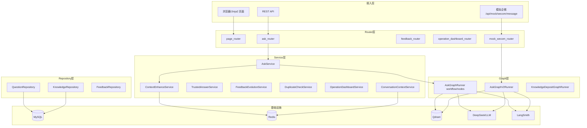

# 系统架构设计

## 1. 技术栈

```text
FastAPI + Jinja2 + MySQL + Redis + Qdrant + LangGraph + LangSmith + DeepSeek/LLM
```

## 2. 分层架构



## 3. 各层职责

| 层级 | 职责 | 代表目录 |
| --- | --- | --- |
| Router | HTTP 路由、参数校验、响应包装 | `app/routers/` |
| Service | 业务编排、规则计算、不写 SQL | `app/services/` |
| Repository | 只读/读写 SQL、聚合查询 | `app/repositories/` |
| Model | ORM 表结构 | `app/models/` |
| Graph | LangGraph 节点与状态流转 | `app/agent/`、`app/graphs/` |
| RAG | 向量检索、置信度分类 | `app/rag/`、`app/services/retrieval_service.py` |
| Infra | Redis、Qdrant、LLM 客户端 | `app/infra/`、`app/llm/` |

## 4. LangGraph 编排层

- **AskGraphRunner**（`/api/ask`）：`validate → preprocess → retrieve → generate → write_log`
- **AskGraphV2Runner**（企微模拟问答）：`normalize → retrieve → judge → generate/fallback → persist_logs`
- **KnowledgeDepositGraphRunner**（沉淀）：完整性 → 质量 → 重复预检 → 创建 pending 卡片

## 5. Redis 上下文层

- 沉淀 session：`DepositSessionService`（TTL 600s）
- 多轮追问上下文：`ConversationContextService`（TTL 1800s）
- Key 前缀：`digital_employee:conversation:{group}:{user}`

## 6. LangSmith 观测层

- AskGraphV2 可选 RunTree 追踪
- 脱敏 question/answer preview
- 配置项：`LANGSMITH_TRACING`、`LANGSMITH_API_KEY`、`LANGSMITH_PROJECT`

## 7. MySQL 数据层

- 问答日志、反馈、知识卡片、审核、向量任务、运行日志等
- 增强阶段不新增表，扩展字段 + 两张治理表（revision、duplicate_check_log）

## 8. 设计原则

1. **app.main 启动不强依赖** MySQL / Qdrant / LLM（按需连接）
2. **Repository → Service → Router** 单向依赖
3. **反馈/沉淀指令优先于普通 RAG**（CommandRouter 路由顺序）
4. **补充反馈不直接改正式知识卡片**
