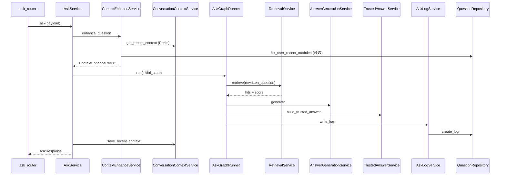

# 问答调用链详解

## 1. /api/ask 链路



**文字链路**：

```text
ask_router → AskService → ContextEnhanceService → AskGraphRunner
  → RetrievalService → AnswerGenerationService → TrustedAnswerService
  → AskLogService → QuestionRepository
```

## 2. 企微模拟问答链路

```text
mock_wecom_router → CommandRouter → ContextEnhanceService
  → AskGraphV2Runner → RagRetrievalService → RagAnswerService
  → TrustedAnswerService → AskRunLogService → ConversationContextService
```

反馈/沉淀指令在 `CommandRouter.route()` 中**优先于** `_handle_normal_question`。

## 3. 原始问题如何进入

- HTTP：`AskRequest.question` → `ContextEnhanceResult.original_question` → `state.question_raw`
- 企微：`WeComMessage.content` → 同上

## 4. rewritten_question 如何生成

1. **明确业务上下文**（含「合同系统」等）→ 不改写
2. **追问 + Redis 有上下文** → `rewrite_with_recent_context` → `context_source=redis_recent_turn`
3. **模糊问题 + 无 Redis + 有 30 天常问模块** → `rewrite_with_recent_modules` → `context_source=user_recent_modules`
4. 否则 `rewritten_question = original_question`

核心文件：`app/services/context_enhance_service.py`

## 5. Qdrant 如何检索

- V1 路径：`RetrievalService.retrieve(question_masked)` → Qdrant 相似度 → `RetrievalHit` 列表
- V2 路径：`RagRetrievalService.retrieve(normalized_question)` → contexts + top_score

## 6. 置信度如何判断

- `classify_confidence(score)` 或 RagRetrieval 内置分级
- 等级：`high` / `medium` / `low` / `none`
- `TrustedAnswerService` 决定低置信度是否强答、是否展示来源

## 7. 来源如何展示

- top1 卡片：`primary_matched_card_id`、`primary_matched_card_title`
- 答案尾部追加来源说明（高/中置信度）
- 低置信度/未命中：不展示虚假来源

## 8. question_log 如何落库

| 字段 | 来源 |
| --- | --- |
| question_raw | 用户原始问题 |
| rewritten_question | 改写后问题 |
| used_context | 0/1 |
| context_source | redis_recent_turn / user_recent_modules / none |
| confidence_level、answer_status | TrustedAnswerService |
| system_name、module_name | top1 卡片或日志回填 |

写入：`AskLogService.create_question_log` 或 `AskRunLogService.create_question_log_from_v2_state`

## 9. Redis 上下文如何保存

- 时机：问答成功且 answer 非空
- Key：`digital_employee:conversation:{group_id}:{user_id}`（无私聊 group 时用 `private:{user_id}`）
- TTL：1800 秒（30 分钟）
- 内容：最近 1 轮问题摘要、系统/模块、top1 卡片、回答摘要（≤300 字）
- 文件：`app/services/conversation_context_service.py`

## 10. 关键文件索引

| 文件 | 作用 |
| --- | --- |
| `app/routers/ask_router.py` | /api/ask 入口 |
| `app/services/ask_service.py` | 同步问答编排 |
| `app/agent/nodes.py` | LangGraph 节点 |
| `app/wecom/command_router.py` | 企微模拟分发 |
| `app/graphs/ask_graph_v2.py` | V2 异步 Graph |
