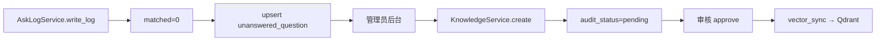
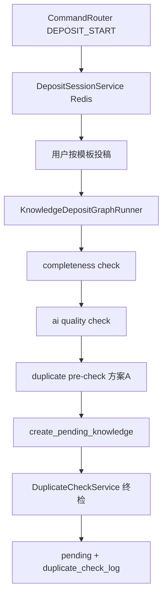

# 知识沉淀调用链详解

## 1. 两条沉淀路径

| 路径 | 触发 | 入口 |
| --- | --- | --- |
| 未命中补充 | 问答未命中 | 后台 `unanswered_question` → 手工建卡 |
| 企微指令沉淀 | 用户发「沉淀」 | `CommandRouter` → `KnowledgeDepositGraphRunner` |

## 2. 未命中 → 知识卡片

## 3. 企微【沉淀】指令链路

## 4. 关键步骤说明

### 4.1 KnowledgeDepositGraphRunner

- 文件：`app/graphs/knowledge_deposit_graph.py`
- 解析结构化投稿字段（系统、模块、问题、答案等）

### 4.2 completeness check

- 必填字段不全则拒绝，提示补全

### 4.3 ai quality check

- 对投稿内容做质量评估（可 mock，回归 fast 模式稳定）

### 4.4 duplicate pre-check（方案 A）

- Graph 内 `duplicate_check` 节点仅做轻量预检，**不阻断**流程
- 最终治理在 `create_pending_knowledge` 阶段由 `DuplicateCheckService` 执行

### 4.5 DuplicateCheckService

- 文件：`app/services/duplicate_check_service.py`
- 输出：`high_duplicate` / `suspected_duplicate` / `related` / `none`
- 写入：`knowledge_duplicate_check_log`

### 4.6 pending 状态

- 新卡片 `audit_status=pending`，需管理员审核

### 4.7 审核通过

- `approve` → `enabled=1` → 触发向量同步任务

### 4.8 Qdrant 向量同步

- `vector_sync_task` 记录任务状态
- `knowledge_card.vector_status`：success / pending / failed

## 5. 核心文件

| 文件 | 作用 |
| --- | --- |
| `app/wecom/command_router.py` | 沉淀指令路由 |
| `app/services/deposit_session_service.py` | Redis 沉淀 session |
| `app/graphs/knowledge_deposit_graph.py` | 沉淀 Graph |
| `app/services/duplicate_check_service.py` | 重复检测 |
| `app/services/knowledge_service.py` | 卡片创建与审核 |

## 6. 不负责的内容

- 自动合并重复卡片
- 沉淀时直接发布为 approved（必须审核）
- 真实企微文件上传
