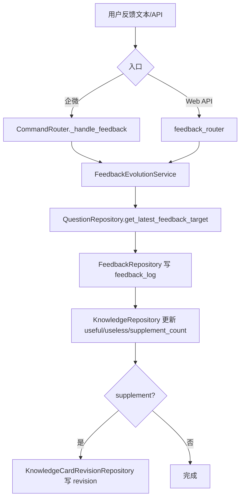

# 反馈闭环调用链详解

## 1. 三类反馈

| 类型 | 示例 | feedback_type |
| --- | --- | --- |
| 有用 | 「有用」「已解决」 | useful |
| 无用 | 「无用：步骤不完整」 | useless |
| 补充/纠错 | 「补充：正确答案是…」 | supplement |

## 2. 调用链



**文字链路**：

```text
用户反馈 → CommandRouter / feedback_router
  → FeedbackEvolutionService
  → QuestionRepository 绑定最近 question_log
  → FeedbackRepository 写 feedback_log
  → KnowledgeRepository 更新计数
  → KnowledgeCardRevisionRepository 生成修订建议
```

## 3. 最近问答绑定规则

- 查询用户近 30 分钟内最近一条可反馈 `question_log`
- 同 group_id 优先
- 优先绑定有 `primary_matched_card_id` 的记录
- 无最近问答 → 返回友好错误，**不进入 RAG**

文件：`app/repositories/question_repository.py` → `get_latest_feedback_target`

## 4. 有用反馈

- 写 `feedback_log`（feedback_type=useful）
- `knowledge_card.useful_count += 1`
- 更新 `quality_score`、`last_feedback_time`

## 5. 无用反馈

- 写 `feedback_log`（可带 reason_text）
- `knowledge_card.useless_count += 1`
- 累计无用较多时 `need_review=1`

## 6. 补充反馈

- 写 `feedback_log`（supplement_text）
- `knowledge_card.supplement_count += 1`
- 创建 `knowledge_card_revision`（status=pending）

**重要**：补充反馈**不直接修改**正式 `knowledge_card.answer`，只生成修订建议供后续人工处理。

## 7. 与 CommandRouter 优先级

```python
# 反馈指令优先于普通 RAG 问答
if FeedbackEvolutionService.is_feedback_text(message.content):
    return await self._handle_feedback(message)
return await self._handle_normal_question(message)
```

文件：`app/wecom/command_router.py`

## 8. API 入口

- `POST /api/feedback` — 结构化反馈
- `POST /api/feedback/legacy` — 兼容旧版

## 9. 核心文件

| 文件 | 作用 |
| --- | --- |
| `app/services/feedback_evolution_service.py` | 反馈闭环主逻辑 |
| `app/routers/feedback_router.py` | HTTP API |
| `app/repositories/feedback_repository.py` | feedback_log 读写 |
| `app/models/knowledge_card_revision.py` | 修订建议 ORM |
