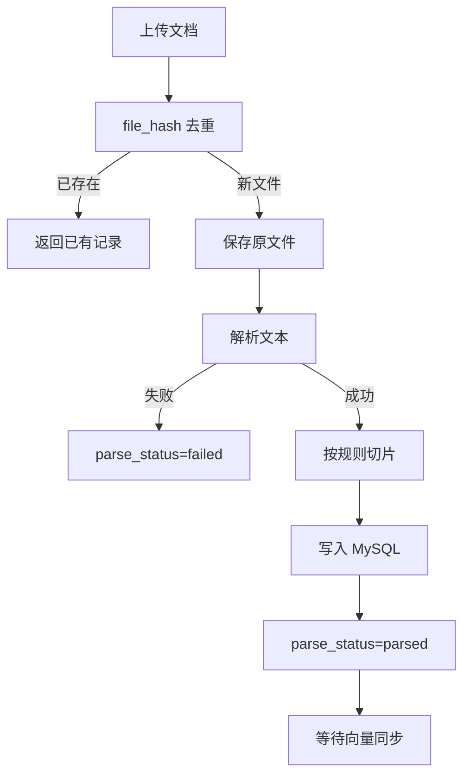

# 文档上传与切片流程

## 1. 上传入口

| 类型 | 路径 | 说明 |
| --- | --- | --- |
| 页面列表 | `GET /documents` | 文档列表、解析状态、切片数量 |
| 上传页 | `GET /documents/upload` | 表单上传（文件 + 元数据） |
| 详情页 | `GET /documents/{doc_id}` | 基础信息 + 切片预览 |
| REST API | `POST /api/documents/upload` | multipart：`file` + `doc_name` 等字段 |

元数据字段：`doc_name`、`doc_type`（manual/requirement/faq/other）、`system_name`、`module_name`、`version`。

## 2. 数据库表

### document_source（文档主信息）

| 字段 | 说明 |
| --- | --- |
| `doc_name` | 业务文档名称 |
| `doc_type` | manual / requirement / faq / other |
| `file_hash` | SHA-256，**重复上传去重** |
| `parse_status` | pending → parsed / failed |
| `chunk_count` | 切片数量 |
| `enabled` / `deleted` | 启用与逻辑删除 |

### document_chunk（文档切片）

| 字段 | 说明 |
| --- | --- |
| `doc_id` | 关联 `document_source.id` |
| `chunk_index` | 切片序号 |
| `section_title` / `section_path` | 章节标题与完整路径 |
| `page_no` | PDF 页码（其他格式可为空） |
| `content` | 切片正文（含文档上下文前缀） |
| `vector_status` | pending / synced / failed |
| `vector_error` | 向量同步失败原因 |

## 3. 上传调用链

```text
POST /api/documents/upload 或 POST /documents/upload
  → DocumentRouter / page_router
  → DocumentService.upload()
      → file_hash 去重（相同内容直接返回已有记录）
      → 保存原文件到 data/uploads/documents/
      → DocumentParseService.parse_file()
      → DocumentChunkService.build_chunks()
      → DocumentRepository 写入 document_source + document_chunk
      → parse_status: pending → parsed / failed
```

## 4. 切片规则

| 格式 | 规则 |
| --- | --- |
| Markdown | 按 `#` / `##` / `###` 分章；长章按自然段再切；目标 500～1000 字 |
| TXT | 空行分段；短段合并；超长段按长度拆 |
| DOCX | 提取段落；识别 Heading 样式则按标题切，否则按段落 |
| PDF | 基础文本提取；按页分段；尽量写入 `page_no`；扫描件不处理 |

每个 chunk 正文前缀包含：文档名、系统、模块、章节路径，便于后续向量化与来源展示。

## 5. 重新解析

`POST /api/documents/{doc_id}/reparse` 或详情页「重新解析」：

1. 旧 `document_chunk` **逻辑删除**（`deleted=1`）；
2. 重新执行解析与切片；
3. 新 chunk 的 `vector_status` 回到 **pending**；
4. 需再次「同步向量」才进入 Qdrant。

## 6. 文件去重

- 上传时计算文件字节 SHA-256 → `file_hash`；
- 若 `file_hash` 已存在且未删除，**不新建** `document_source` 与 chunk；
- 直接返回已有文档记录。

## 7. 流程图



## 8. 验收参考

见 [19_文档RAG验收清单.md](19_文档RAG验收清单.md) 阶段1部分。
