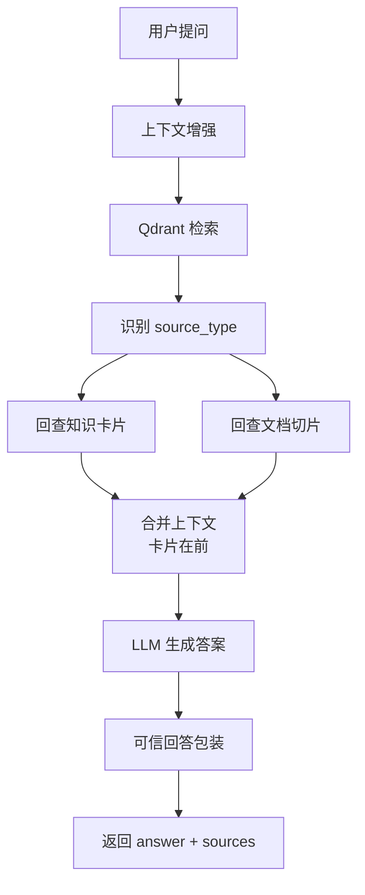

# 文档问答调用链

## 1. 文档向量同步调用链

```text
POST /api/documents/{doc_id}/sync-vector
  → DocumentVectorSyncService.sync_document()
  → list_syncable_chunks_by_doc_id()
  → build_document_chunk_vector_text()
  → build_document_chunk_payload()
  → EmbeddingClient.embed_text()
  → QdrantStore.upsert_document_chunk()      # /api/ask 本地 collection
  → QdrantVectorStore.upsert_point()         # AskGraphV2（远程未配则 warning）
  → chunk.vector_status = synced
  → chunk.vector_id = doc_chunk_{chunk_id}
```

相关 API：

| 接口 | 说明 |
| --- | --- |
| `POST /api/documents/{doc_id}/sync-vector` | 同步单篇文档全部切片 |
| `POST /api/documents/chunks/{chunk_id}/sync-vector` | 同步单个切片 |
| `POST /api/documents/{doc_id}/delete-vector` | 删除该文档向量 |
| `POST /api/documents/rebuild-vector` | 全量重建文档索引 |

## 2. Qdrant point id 规则

为避免与知识卡片 id 冲突：

```text
document_chunk point_id = 10_000_000_000 + chunk_id
MySQL vector_id       = doc_chunk_{chunk_id}
```

知识卡片仍使用 `card.id` 作为 point id（数值较小）。

## 3. document_chunk payload 示例

```json
{
  "source_type": "document_chunk",
  "doc_id": 5,
  "chunk_id": 6,
  "doc_name": "合同操作手册",
  "doc_type": "manual",
  "system_name": "合同管理系统",
  "module_name": "合同变更",
  "section_title": "审批流程",
  "section_path": "合同变更 / 审批流程",
  "page_no": 3,
  "chunk_index": 1,
  "content_hash": "abc123"
}
```

知识卡片 payload 含 `source_type=knowledge_card`；旧数据无 `source_type` 时按 `knowledge_id` / `card_id` 兼容。

## 4. `/api/ask` 检索调用链

```text
POST /api/ask
  → AskService.ask()
  → ContextEnhanceService（可选追问改写）
  → AskGraphRunner
      → retrieve_node
      → RetrievalService.retrieve()
          → QdrantStore.search()
          → 按 source_type 回查 MySQL
          → 知识卡片 hits（≤3）+ 文档切片 hits（≤3）
      → match_judge_node
      → generate_answer_node
          → AnswerGenerationService（含文档上下文块）
      → TrustedAnswerService.build_trusted_answer()
  → AskResponse（answer + sources）
```

企微模拟 / AskGraphV2 路径：

```text
AskGraphV2Runner → RagRetrievalService → RagAnswerService → TrustedAnswerService
```

## 5. 优先级策略

| 规则 | 说明 |
| --- | --- |
| 检索次数 | 单次 Qdrant search，按 payload 分类 |
| 知识卡片 | 最多 3 条，排在上下文**前面** |
| 文档切片 | 最多 3 条，排在上下文**后面** |
| top1 来源 | **优先取知识卡片**；仅无卡片时取文档 |
| 答案主导 | 高质量知识卡片不应被文档切片覆盖 |
| 置信度 | `top_score` 取最高分；`classify_confidence` 沿用原逻辑 |

## 6. sources 返回示例

```json
{
  "matched": true,
  "answer_source": "document_chunk",
  "sources": [
    {
      "source_type": "document_chunk",
      "card_id": 0,
      "title": "合同操作手册",
      "score": 0.82,
      "chunk_id": 6,
      "doc_id": 5,
      "doc_name": "合同操作手册",
      "section_path": "合同变更 / 审批流程",
      "page_no": 3
    }
  ]
}
```

旧前端若只读 `card_id` / `title` / `score` 仍可兼容；文档来源 `card_id` 为 0。

## 7. 问答流程图



## 8. 与原有链路关系

- **未重写** `/api/ask` 响应结构；在 `AskSourceItem` 上扩展可选字段。
- **未删除** 知识卡片检索；`DuplicateCheckService` 仍只比对卡片。
- 详见 [04_问答调用链详解.md](04_问答调用链详解.md) 原有问答链路。
